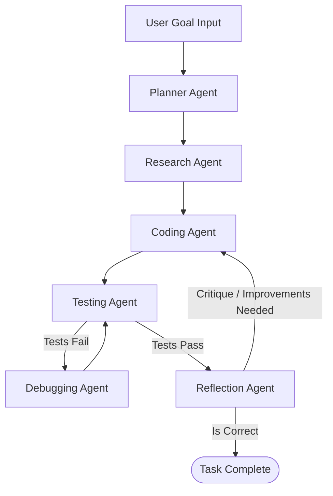

# DeepPilot 🚀

An autonomous, multi-agent AI engineering software system built with **LangGraph**, **FastAPI**, **Streamlit**, and **Local Ollama LLMs**.

`DeepPilot` takes high-level user engineering goals (e.g., *"Build a FastAPI CRUD API for a bookstore"*) and autonomously plans, researches, writes code, executes tests, debugs errors, and reflects on its own architecture to deliver production-ready software—all while running 100% locally and offline.

---

## 🏗️ System Architecture

`DeepPilot` orchestrates a stateful multi-agent workflow using LangGraph:



### Specialized Multi-Agent Roles
Each agent in the workflow can be assigned specialized offline Ollama models:
- **🧠 Planner Agent (`deepseek-r1:8b`)**: Breaks high-level requirements into concrete, step-by-step architectural execution plans.
- **📚 Research Agent (`deepseek-r1:8b`)**: Investigates technical requirements, gathers context, and formulates technical strategies.
- **💻 Coding Agent (`qwen2.5-coder:7b`)**: Generates production-ready Python/full-stack code based on researched context and vector memory.
- **🧪 Testing Agent (`qwen2.5-coder:7b`)**: Writes comprehensive `pytest` unit suites and runs them in the terminal sandbox.
- **🔧 Debugging Agent (`qwen2.5-coder:7b`)**: Analyzes stack traces and physical test outputs to autonomously repair failing code.
- **🛡️ Reflection Agent (`deepseek-r1:8b`)**: Critiques the generated solution for security, scalability, and correctness before storing successful patterns in ChromaDB episodic memory.

---

## ⚡ Quick Start

### 1. Prerequisites
Ensure you have [Ollama](https://ollama.com/) installed and running locally. Pull the recommended models:

```bash
ollama pull deepseek-r1:8b
ollama pull qwen2.5-coder:7b
ollama pull nomic-embed-text
```

### 2. Installation
Navigate into the core package directory and install dependencies:

```bash
cd deep_ai_engineer
pip install -r requirements.txt
```

### 3. Environment Configuration
Create or inspect your `.env` inside `deep_ai_engineer`:

```env
OLLAMA_HOST=http://localhost:11434
CHROMA_DB_PATH=./memory_store

# Local Ollama Model Assignments
PLANNER_MODEL=deepseek-r1:8b
RESEARCH_MODEL=deepseek-r1:8b
CODING_MODEL=qwen2.5-coder:7b
DEBUGGING_MODEL=qwen2.5-coder:7b
REFLECTION_MODEL=deepseek-r1:8b
EMBEDDING_MODEL=nomic-embed-text
```

---

## 🚀 Running DeepPilot

### Start the Backend API Server
Launch the FastAPI workflow orchestration backend:

```bash
cd deep_ai_engineer
uvicorn api.main:app --reload --port 8000
```
*API Documentation will be available at `http://127.0.0.1:8000/docs`.*

### Start the Interactive Frontend
In a separate terminal window, launch the Streamlit workspace dashboard:

```bash
cd deep_ai_engineer
streamlit run frontend/app.py
```
*Access the workspace UI at `http://localhost:8501` to submit engineering tasks and monitor live agent execution.*

---

## 🧠 Memory & Vector Store
DeepPilot features persistent local memory powered by **ChromaDB**:
- **Short-Term Memory**: Tracks active workflow steps and intermediate outputs.
- **Episodic Memory**: Archives successful task executions and final code solutions.
- **Semantic Memory**: Stores reusable design patterns and architectural lessons for future engineering runs.

---

## 📄 License
MIT License. Free and open-source for personal and commercial engineering workflows.
